# Introduction

This program is developed based on the Shiny framework, a set of R packages and a collection of scripts written by members of Junhyong Kim Lab at University of Pennsylvania. Its goal is to facilitate fast and interactive RNA-Seq data analysis and visualization. Current version of PIVOT supports routine RNA-Seq data analysis including normalization, differential expression analysis, dimension reduction, correlation analysis, clustering and classification. Users can complete workflows of DESeq2, monocle and scde package with just a few button clicks. All analysis reports can be exported, and the program state can be saved, loaded and shared.

See http://kim.bio.upenn.edu/software/pivot.shtml for more details.

# Installation

* Main Program: Please copy and paste the following command to R console. 
  * Upgrading R and Rstudio to the latest version (R >= 3.4, Rstudio > 1.0.0) is strongly recommended. 

```
# dependecies that needs to be manually installed 
# Copy the following line by line.
install.packages("devtools") 
library("devtools")
source("http://bioconductor.org/biocLite.R")  
biocLite("GO.db")
biocLite("HSMMSingleCell")
biocLite("org.Mm.eg.db")
biocLite("org.Hs.eg.db")
biocLite("DESeq2")
biocLite("SingleCellExperiment")
biocLite("scater")

# Install PIVOT
install_github("qinzhu/PIVOT")
biocLite("BiocGenerics") # You need the latest BiocGenerics >=0.23.3
```
 * (Optional but strongly recommended):
   * For report generation, you need Pandoc: http://pandoc.org/installing.html
   * For PDF report generation, you need Latex: https://www.latex-project.org/get/
   * If you have 10x data output from Cell Ranger, please install Cell Ranger R Kit from https://support.10xgenomics.com/single-cell-gene-expression/software/pipelines/latest/rkit
   to allow PIVOT to directly read in the data.
 
 * We are moving PIVOT to bioconductor for easier installation in the future, stay tuned.

# Launch PIVOT

  * To run PIVOT, in Rstudio console, use command 
```
library(PIVOT)
pivot()
```

# Data Input

## Input expression matrix

* To input expression matrix, select "Counts Table" as input file type. PIVOT expects the count matrix to have rows as genes and samples as columns. Gene names and sample names should be the first column and the first row, respectively.

* PIVOT support expression matrix in csv, txt, xls or xlsx formats. Choose proper settings on the left file input panel until the right "Loaded File Preview" correctly shows the data frame.


* you need to make sure that the data matrix:

    + *Contains no NA or non-numeric values.*
    
    + *Does not have duplicated feature or sample names (PIVOT will alert the user if it detects any).*

<p style="clear:both;">

## Input counts directory

* If you have counts files with genes in the first column and gene counts in the second column. You can input the entire data folder. PIVOT will automatically combine the counts files into an expression matrix. Note you need to make sure that the files are all quantified using the same pipeline with the same annotation file.

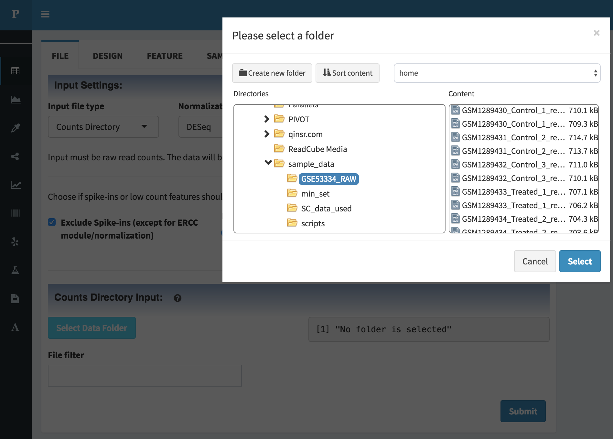

* PIVOT also allows you to select subset of files in the folder. E.g., type 'exon' in the filter textbox to only select files with "exon" in the file name.

<p style="clear:both;">


## Input 10x Cell Ranger output

* You need to install Cell Ranger R Kit from 10x Genomics to allow PIVOT to directly read in 10x data:
https://support.10xgenomics.com/single-cell-gene-expression/software/pipelines/latest/rkit

* Then choose "10x Directoy" for input file type, and use the "Select 10x Folder" button to point PIVOT to the Cell Ranger output directory (the folder containing the "outs" folder).

* By default, PIVOT will use gene symbol as row names for the expression matrix, the other option is the gene id, which is the default setting of Cell Ranger output.

## Data Normalization

We have included a multitude of normalization methods in PIVOT. Some normalization methods are mostly used for bulk RNA-Seq data, while others may only be applicable to single-cell data. Users should be aware of which method best suits their data. 

* If your data has already been processed by DESeq or other methods, please specify "none" in the normalization method. 

* If DESeq failed on your data, one possibility is that you have low counts samples, which leads to all the genes contain at least one 0 in the counts matrix. You can either find out and remove these samples, or choose the "modified DESeq" normalization method. Setting sample inclusion 100% is equivalent to the original DESeq.

* Some normalization method require additional information from the user. For example, if you choose ERCC normalization then you must provide experimental parameters. Please also make sure the ERCC feature names matches those in the standard table: (<a href = "https://tools.thermofisher.com/content/sfs/manuals/cms_095046.txt">https://tools.thermofisher.com/content/sfs/manuals/cms_095046.txt</a>).


* PIVOT applies a pre-filtering step before doing normalization. By default, PIVOT will filter out genes with all 0 expressions. Users can also specify a different row mean or row sum threshold to remove those low confidence features. 

* Once data have been normalized, you can check the normlization details which contain information such as the estimated size factors.


<p style="clear:both;">

## Input Design Information

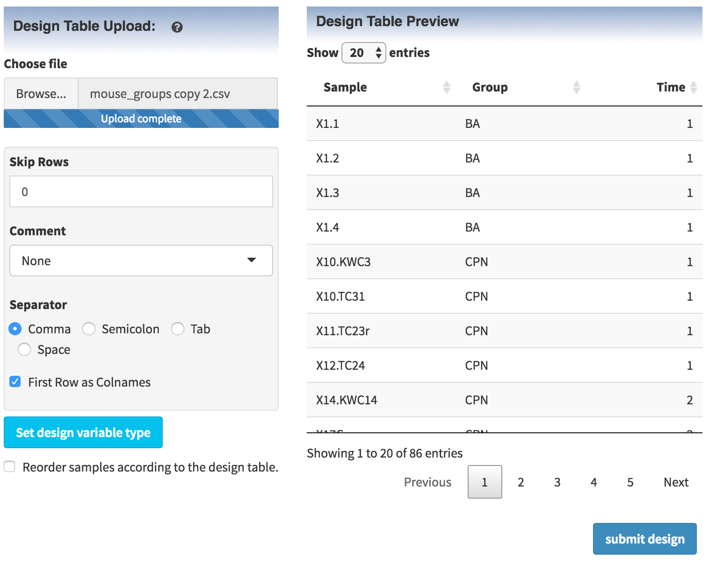

* The design infomation are used for sample point coloring and differential expression analysis. Users can input the entire sample meta sheet as design information, or manually specify groups or batches for each sample.

* The first column of the design table should always be the sample name list, which must include all samples that's in the expression matrix. The rest columns will be treated as "categories" or "design variables", which can be "condition", "batch", "operator", "experiment date", etc. You will be able to choose which category to be used for analysis such as DE, as well as if the category should be treated as categorical or numerical. 

* You can also manually make a design-info file by specifying the sample grouping in PIVOT, and download it for later upload.


* Empty or NA entries are allowed in design table. But You need to make sure the categories used for DE testing (conditions/time points/batches) do not contain NAs.

* The design categories will be used as "meta" info for sample coloring in many modules, such as PCA or heatmap.

<p style="clear:both;">

## Load Example Dataset


* We have included in PIVOT an example dataset from Dueck, Hannah, et al., 2015. This data consists of a subset of cells from 5 different cell types (brown adipocytes (BA), cardiomyocytes (CM), cortical pyramidal neurons (CPN) and hippocampal pyramidal neuron (HPN)). User can press the question mark button on the top right corner of PIVOT and the "Load Example" button to load this example dataset. Results of many modules have already been pre-computed for users to explore all features of PIVOT.

<p style="clear:both;">

# Data Manipulation

## Feature ID/Name Conversion

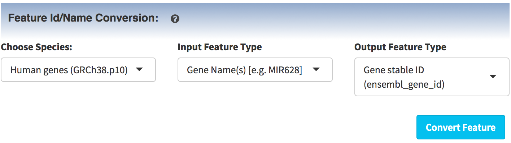

PIVOT supports automatic ID/Name conversion and supports most of the ID/Names listed in the BioMart database. Despite this powerful feature, we still recommend users to get the feature name right in the first place (i.e., use proper gene id/name output when doing the count quantification), as id/name conversion could inevitably lead to id or name duplicates, and unmapped features.

* For features that has no match in the database, PIVOT will keep its original ID.
* For features that map to multiple entries in the database, PIVOT will use the first matched entry.
* For multiple features that map to one entry in the database, PIVOT will name the duplicates as 'name.1', 'name.2',etc.
* Note that feature name conversion will be performed globally. To keep the consistency of downstream subsetting, filtering and analysis, all previous data subsets will be deleted from the current session. Thus, we recommend users convert feature IDs first before generating any data subsets, if necessary. 

## Feature Filtering

* There are currently 3 types of feature filter in PIVOT: the expression filter, which filters based on various expression statistics; the feature list filter, which filters based on user input gene list; and the P-value filter, which filters data with differentially expressed genes.

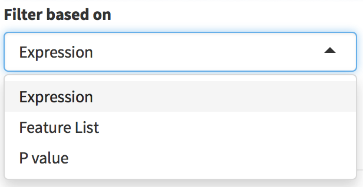

**Expression Filter**: PIVOT incorperates the `scater` package to provide users various QC plots for feature filtering. You can choose any of the stats and select range to only keep those features within the specified range.

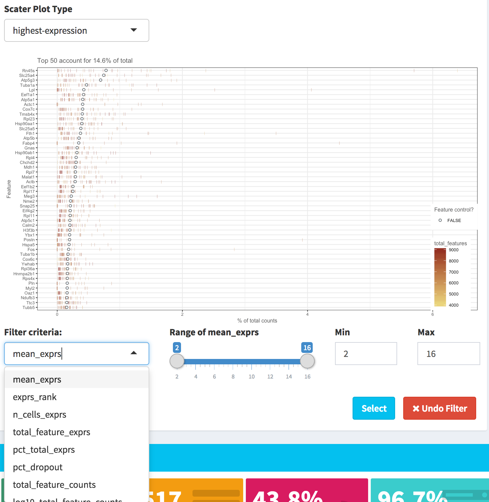

* Filter can be either positive (selecting the genes that satisfy the condition) or negative (delete the genes). 
    
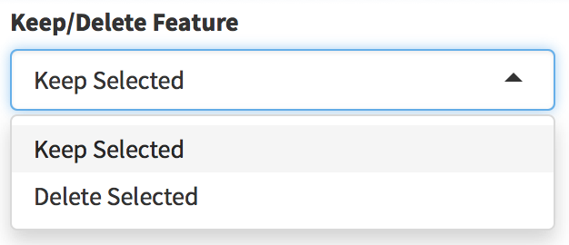

**Feature List Filter**: You can provide a marker feature list to get a marker feature expression subset.
    
* The marker features should appear as the first column in your file.
    
* Some of the features in your marker list may not be found in the dataset, because they may have already been removed due to 0 expression in all your samples.

**P-Value Filter**:

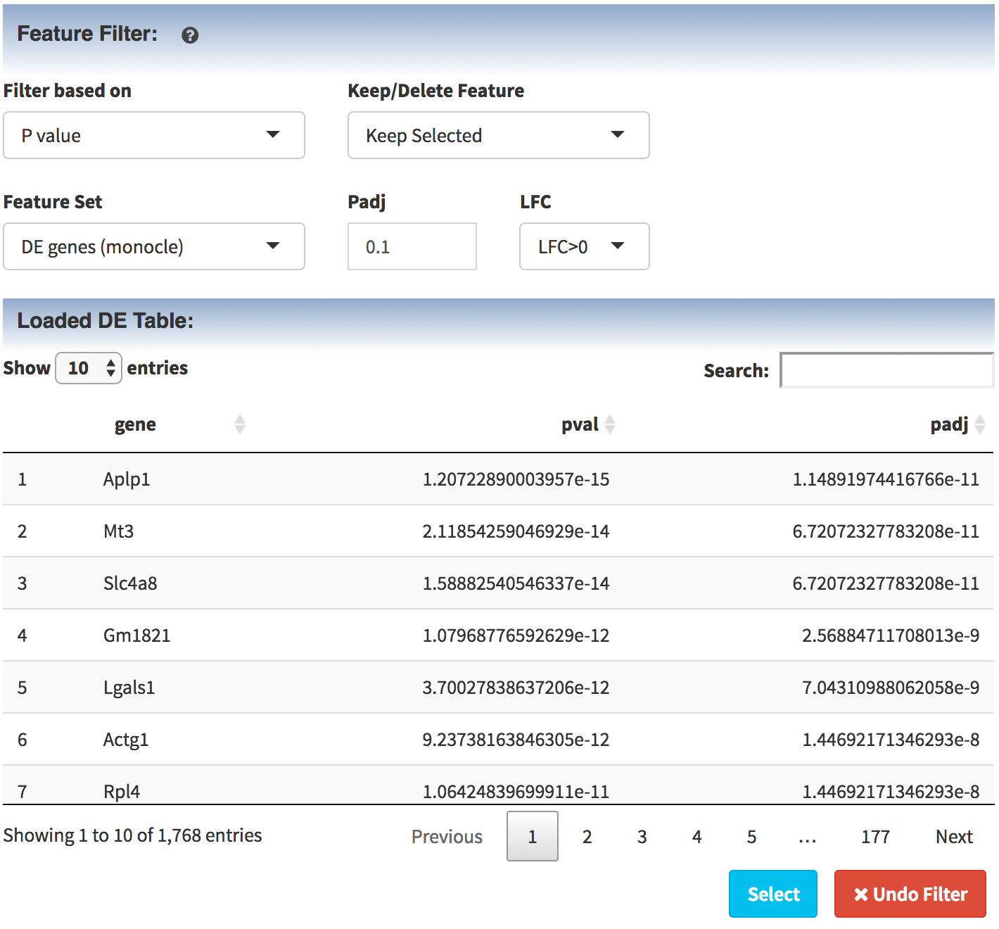

* Once users have performed DE analysis, PIVOT will automatically load the results to the P-value filter to allow users to filter the data with significant DEGs. You can change the P value threshold, as well as the direction of log fold change. 

**Removing Filtering Effects**

* Applying  will return the data to the unfiltered state, i.e., if you have performed sample subsetting prior to filtering, the dataset will return to the sample subset.

## Sample Subsetting

* Subsetter allows you to choose a subset of samples for analysis. You can either manually select samples, groups, upload a sample list or subset based on sample statistics.

* To filter based on sample statitics, you can directly drag on the sample stats plot to specify a range. 


* You can choose whether or not the subset should be renormalized. You can change the re-normalization method and associated parameters in the "FILE" panel. 

* An implicit filtering will occur to get nonzero count genes for the subset. This procedure prevents some downstream analysis from breaking on 0s.

* Applying  will return the data to the original input dataset, which means all filtering or subsetting effects will be removed.

## Data Map


* With each data filtering/subsetting operation, you are creating data subsets whose lineage can be tracked using the data map. Mouse over each edge in the map will show you the operation details, and you can switch between data subsets, rename nodes, delete subsets or add notes by simply selecting the nodes and click buttons.

* To attach analysis to the nodes, simply click the magnet  button on the top right corner of each analysis box. The rest of the buttons are for pasteing R markdown reports to the report module, generating HTML reports and box collapsing.


# Basic Statistics

## Data Scale & Data Table


* For most analysis modules, you can choose one of the four data scales: 

    + `counts (normalized)` : DESeq normalized counts; 
    
    + `Log10` : log10 (normalized_counts + 1). Plus one to include zeros;
    
    + `Standardized` : Standardization (calculate Z-scores) is performed on the DESeq normalized counts;
    
    + `Log10 & Standardized` : Standardization (calculate Z-scores) is performed on log10(normalized_counts + 1), assuming log-normal distribution.
    
* For each individual analysis, please choose the most proper data scale. Some modules have fixed data scale choice (e.g., raw counts input for DESeq differential analysis) so this option is not available.

* You can download data table with different data scales and ordering. 
    
* The `relative frequency` of a gene is defined as its raw count divided by the total counts of the sample.

* Clicking features in the data table will plot its expression in the bottom panel, you can choose various plot types including point/bar plot, box plot or violin plot. You can also convert the plot to an interactive plot.


    
## Meta Data (Design) Composition 


* You can visualize the composition of each design category as pie chart. For example, you may use this pie chart to assess the cell type composition of your data.

## Sample/Feature Statistics

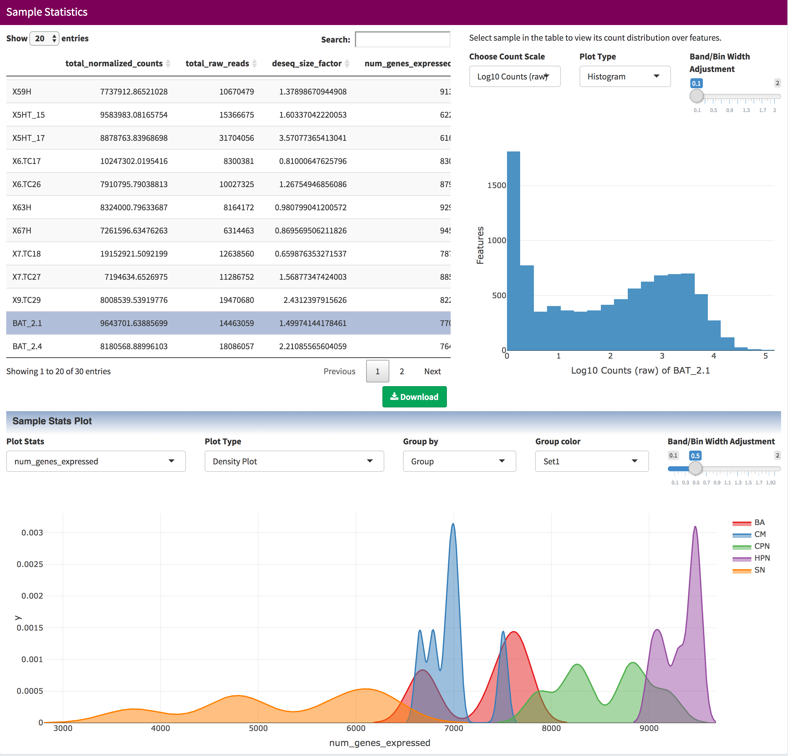

* The sample statistics panel allow you to visualize various important sample statistics. For example, clicking a sample in the left table will plot the feature count distribution. Normlization method like Census have strong assumptions on the count distribution, so you can use this to check if your data matches their assumption.

* You can also visualize important sample statistics as bar plot, histogram or density plots across samples.

* Similarly, the feature statistics table can be clicked and the selected gene expression can be visualized.

## Data Distribution

* This module provides multiple useful plots for examining the distribution and dispersion of the data. For example, with the mean-variability plotted using the `Seurat` package, a user can identify the variably expressed genes with any expression and dispersion cutoff, and download the gene list for input into other modules like heatmap.

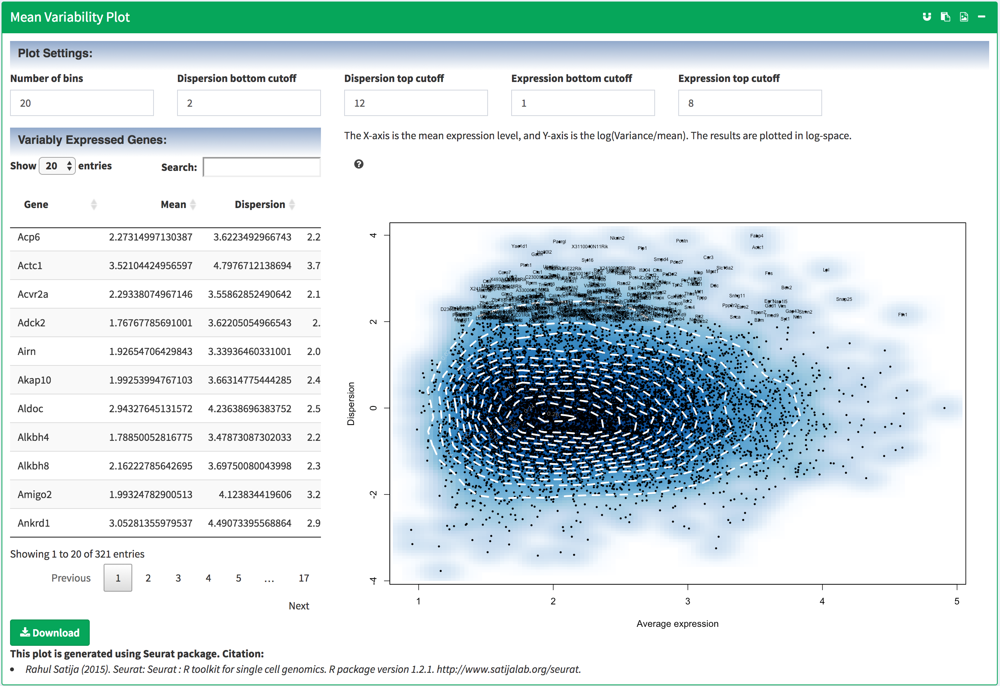

## Spike-in (ERCC) Analysis

* If your data contains ERCC spike-in, PIVOT will automatically find the spike-in features based on
the standard table (<a href = "https://tools.thermofisher.com/content/sfs/manuals/cms_095046.txt">https://tools.thermofisher.com/content/sfs/manuals/cms_095046.txt</a>), and compute the count-molecule relationship, linear regression fit for each sample (direct click on the bars in the bar plot) and binomical logistic regression fit for the ERCC detection rate.

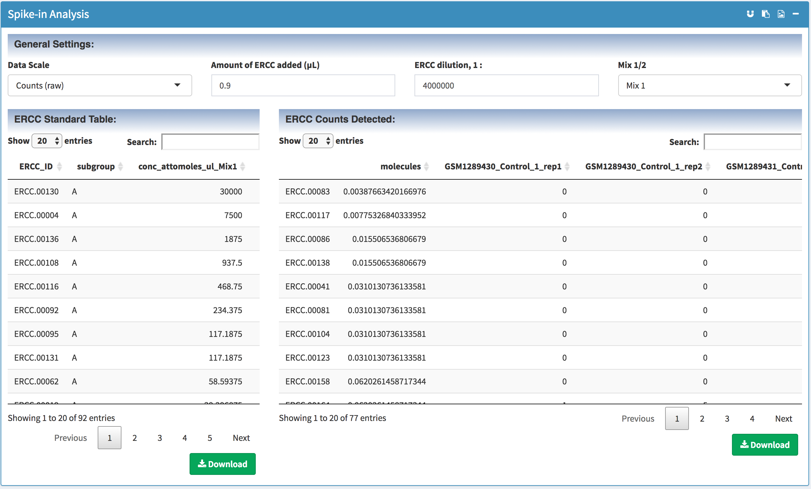

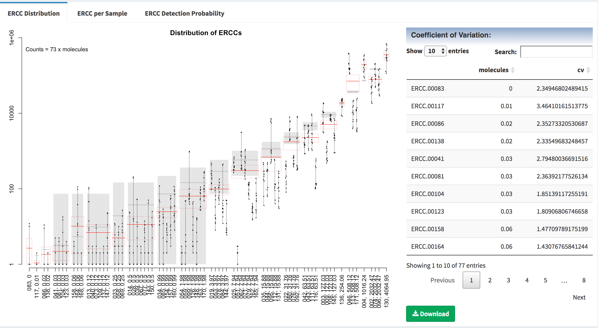


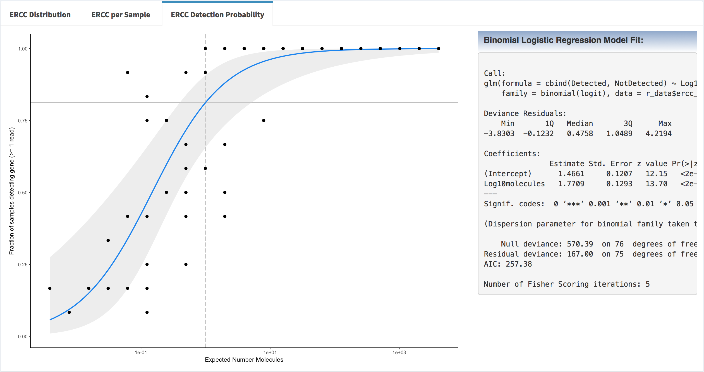

    
# Differential Expression Analysis

## DESeq

* This module is a graphical interface for the DESeq2 package (<a href="https://bioconductor.org/packages/release/bioc/html/DESeq2.html">https://bioconductor.org/packages/release/bioc/html/DESeq2.html</a>). Because DESeq requires raw counts input, if the input file is a normalized counts table, this analysis will not be available.

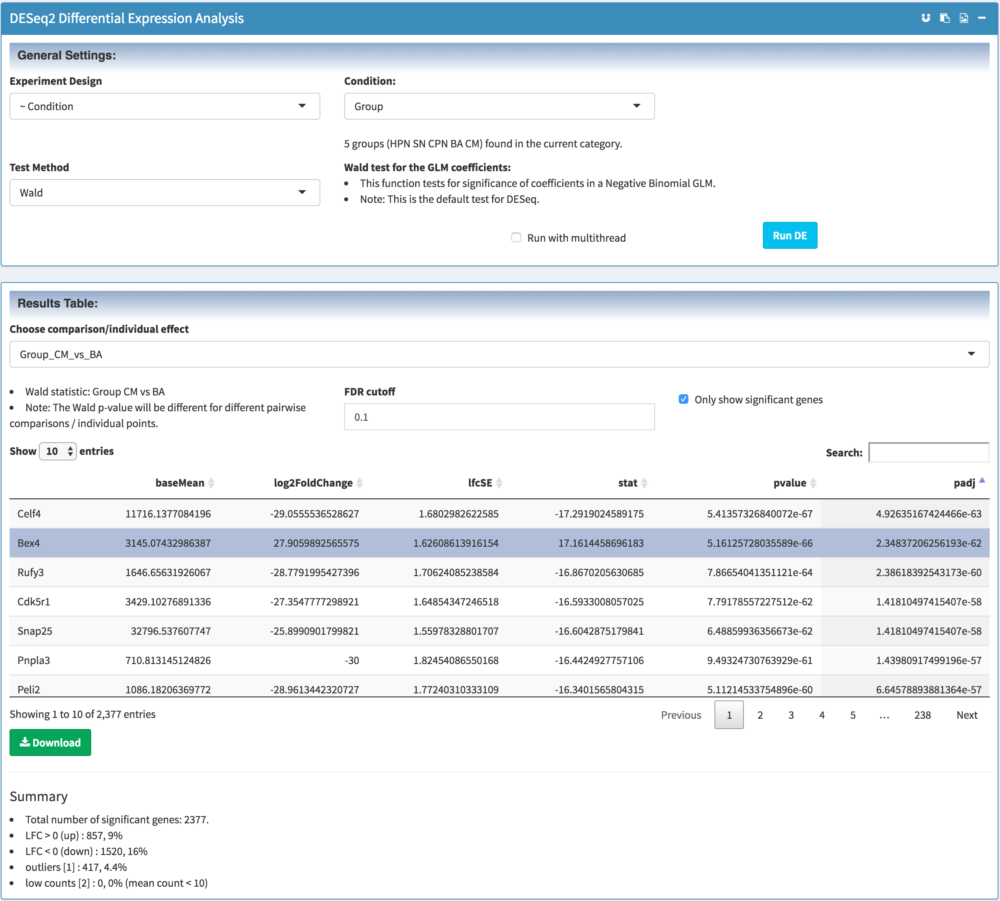

* You can specify any design formula to be used in the test. To do this, choose "use custom design formula" for experimental design and click the "Custom Formula" button. You'll see the following pop-up window.

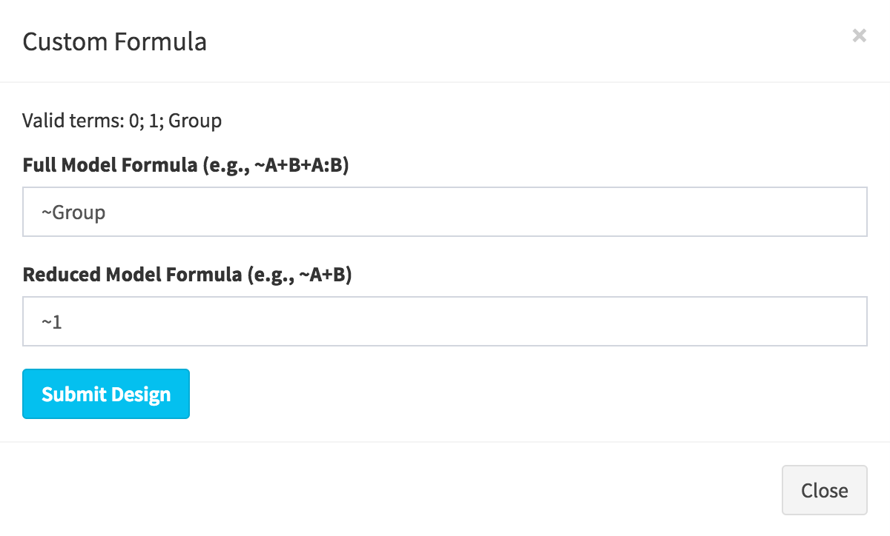

You can specify the full model formula and reduced model formula used for DESeq LRT test. The model formula must be constructed with valid design variables such as the input design categories, 0 or 1.

* Once DE result is obtained. You can click the entries in the table to visualize the gene expression across groups.

## edgeR

* Similarly to DESeq, edgeR require raw count input. To keep the consistency between PIVOT and edgeR package, PIVOT will renormalize the raw count using the edgeR supported methods, including TMM, RLE(DESeq) and UpperQuantile. PIVOT implements all three tests provided by edgeR: exact text, GLM likelihood ratio test and GLM quasi-likelihood F test. For details of these tests, please refer to the edgeR user manual: https://www.bioconductor.org/packages/devel/bioc/vignettes/edgeR/inst/doc/edgeRUsersGuide.pdf

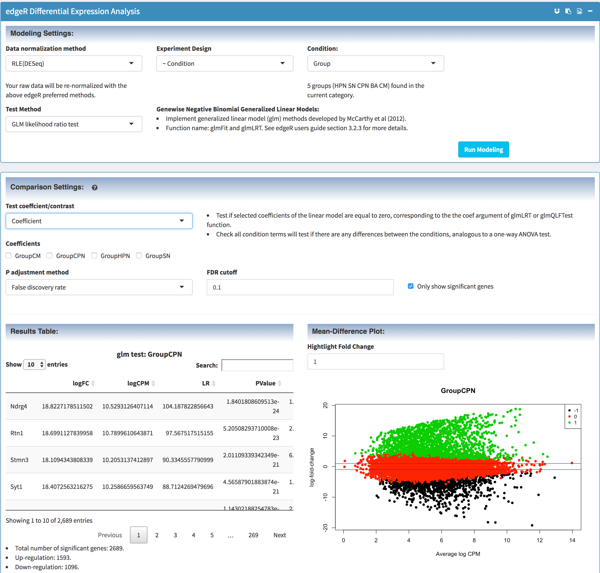

**If use exact test**:

Simply choose which pair to compare.

**If use GLM model**
:
If model contains intercept (formula ~0+XYZ), use contrast, e.g., contrast: (1)A (-1)B) for pairwise group comparison

If model does not contain intercept (default), the first group will be treated as the baseline. The coefficient B will be B vs A and coefficient C will be C vs A. To compare B vs C use contrast: (1)B (-1)C.

See edgeR manual for more detailed explanation.

## SCDE

* This module is a graphical interface for the SCDE package (<a href="http://hms-dbmi.github.io/scde/diffexp.html">http://hms-dbmi.github.io/scde/diffexp.html</a>). 
* Note currently there is a bug causing SCDE to fail in multiple occasions: https://github.com/hms-dbmi/scde/issues/48. PIVOT will update as soon as the SCDE team comes up with a fix.

* The SCDE error modeling must be performed first before you can use other SCDE analysis. For large dataset the modeling process can be very slow. You can monitor the progress in the background R session.

* You can use SCDE distance for hierarchical clustering and minimum-spanning-tree generation. There are three types of adjustment method you can choose: direct drop-out, reciprocal weighting and mode relative weighting. For details of these methods please check the SCDE website. Once a distance has been computed, it is loaded into PIVOT to be used in other modules.

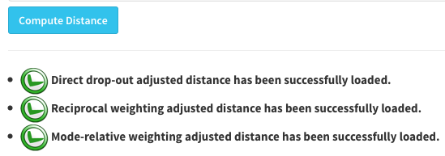

## Mann-Whitney Test

* Also known as wilcoxon rank sum test. The null hypothesis is that the distributions of the gene expression in the two groups has no difference and the alternative is that they differ by some non-zero location shift.

# Monocle Workflow

## Initiate Monocle Cellset and Differential Expression

* PIVOT follows the monocle vignette (http://cole-trapnell-lab.github.io/monocle-release/docs/) and provide a graphical interface for the Monocle package.

* To start, first initate monocle cellset object by choosing a proper distribution for your data, set a minimum expression level (corresponds to min_expr argument), and press "Create Monocle CellDataSet".

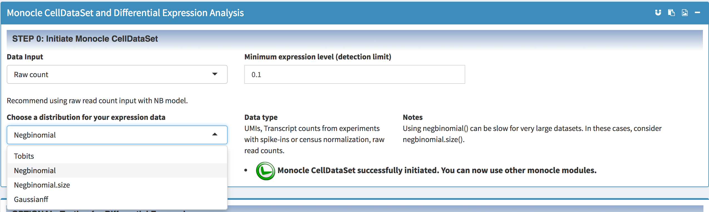

* The DE test in monocle is can be performed in a similar fashion as other DE tests. Note it is generally very slow so we recommend filter your data and choose multiple cores to reduce the computation time.

## Monocle Cell State Ordering

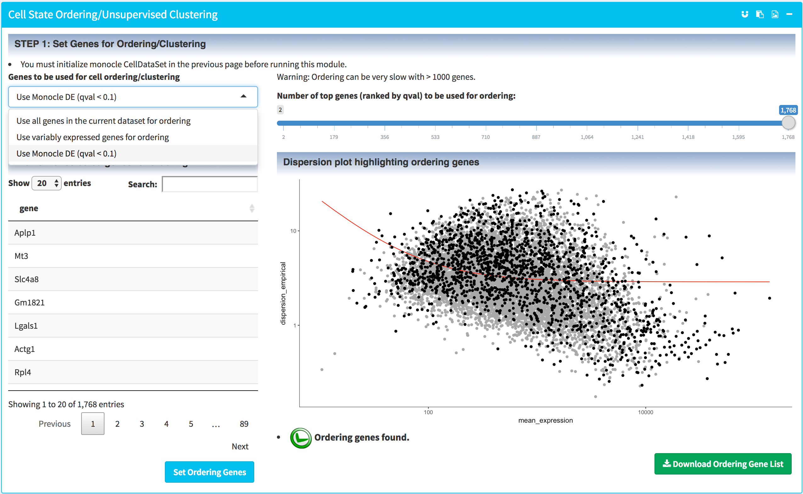

* You can use all genes (not recommended), variably expressed genes or monocle detected DEGs for cell state ordering. Once you select your ordering gene set, simply press "Set Ordering Genes". You should be able to see the right side dispersion plot highlighting the selected ordering genes.

* As described in the monocle documentation, it offers two anaylsis cell types: cell state ordering and unsupervised clustering. Once you choose the analysis type and specified the relevant parameters, press the run button to proceed. 

* If the analysis type is ordering, the result will add two columns to the sample meta sheet: Pseudotime and State. Clustering will generate a "Cluster" column.

* If you have provided group information, PIVOT will automatically compare the assigned state/cluster to your groups by generating a confusion matrix and a comparison plot.

* Cell state ordering will also generate a cell trajectory plot. You can click the gene list to view the expression level of the selected gene plotted on the graph or as a function of pseudotime or cell state. **Note because the example dataset is composed of different cell types, the assigned state in the plot below does not have any biological meaning but only serve as a demo.**
    


## Monocle Gene Expression Pattern Analysis

* Once cell state ordering is done, you can visualize the gene expression pattern across states by simply click the gene entries in the table.

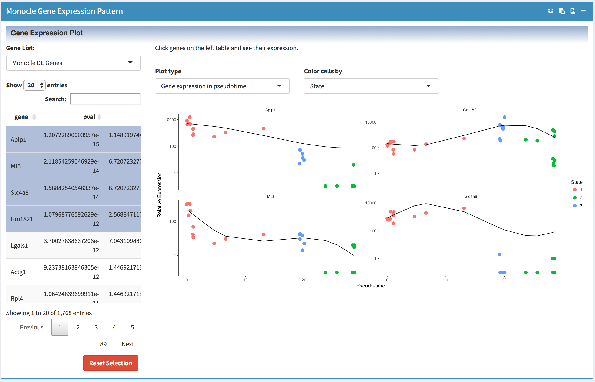

* You can also cluster DE genes or any custom gene set by their pseudotemporal expression pattern. Note if you have large number of genes to cluster, it is recommended to use multiple cores to reduce the computing time.

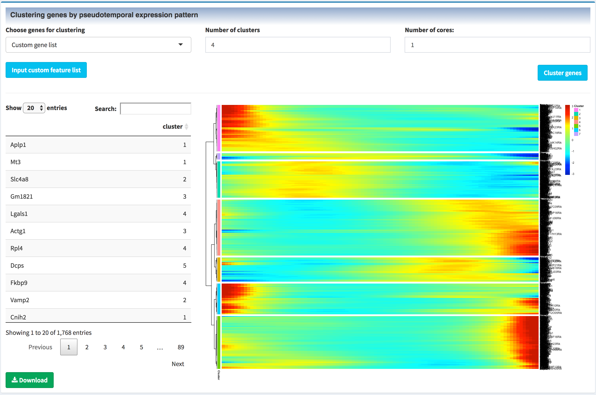

# Clustering

## Hieararchical Clustering

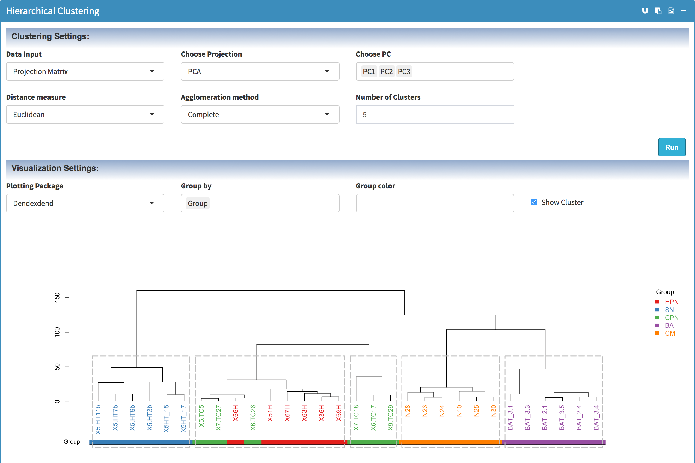

* You can perform hierarchical clustering on various transformations of the expression matrix, as well as projection matrix of PCA, t-SNE, MDS or diffusion map. The latter requires you to have performed corresponding analysis first. For projections by PCA or diffusion map, you can further choose which sets of PC/DCs should be used as input for clustering.

* You can color the leaves of the dendrogram by multiple sample meta data (design categories). You can use different color sets for different categories by specifying the same number of color palettes in the "group color" input box.

* You can compare the clustering result to existing design categories using the confusion matrix. 

## K-means Clustering

* The procedure is similar to hierarchical clustering. For result summary, between_SS / total_SS is a measure of the clustering result quality. SS stands for Sum of Squares, so it's the usual decomposition of deviance in deviance "Between" and deviance "Within". Ideally you want a clustering that has the properties of internal cohesion and external separation, i.e. the BSS/TSS ratio should approach 1. (Explanation from LambdaVu@stackexchange: https://stats.stackexchange.com/questions/82776/what-does-total-ss-and-between-ss-mean-in-k-means-clustering)

## SC3 Clustering

* This module is a graphical interface for the SC3 package. You can find the full manual for SC3 here: https://bioconductor.org/packages/release/bioc/vignettes/SC3/inst/doc/SC3.html.

* It is recommended to estimate best K first to determine a range of ks for SC3 to explore. Clicking the button and you'll see the k_estimation. Then you can proceed to run SC3. For large dataset we recommend using multiple cores.


* Once SC3 finishes, you should be able to see the average Silhouette plot and Silhouette plot as above. The former tells you the Silhouette statistics across ks, while the latter shows the Silhouette for each cluster and each k. See https://en.wikipedia.org/wiki/Silhouette_(clustering) for detailed explanation on Silhouette.


* You can visualize the consensus matrix computed by SC3. It show the similarity between cells based on the consensus clustering result. The SC3 result table can be downloaded, and the cluster assignment will be automatically loaded as sample meta information for visualization in other modules, e.g., PCA.

## Community Detection

* The community detection module uses the procedure described in Darmanis, Spyros, et al. "A survey of human brain transcriptome diversity at the single cell level." Proceedings of the National Academy of Sciences 112.23 (2015): 7285-7290. 


* The user can choose which pairwise distance metric should be used to generate the minimum spanning tree as well as the parameters of the walktrap community detection algorithm. You can also adjust multiple aesthetics of the graph.


# Correlation Analysis

## Pairwise Scatterplot

* You can generate pairwise scatterplot if you have less than 50 samples. DO NOT run this module if you have too many samples/cells. You should instead use sample correlation heatmap.


* The plot shows pairwise comparison between your samples. The x and y axis of each plot show log10 RPM estimates in the cell corresponding to a given column and row respectively. The set of smoothed scatter plots on the lower left shows the overall correspondence between the transcript abundances estimated in two given cells. The upper right corner shows three-component mixture model, separating genes that “drop-out” in one of the cells (green component shows drop/out events in the column cell, red component shows drop-out events in the row cell). The correlated component is shown in blue. The percent of genes within each component is shown in the legend.

* This module is adapted from the SCDE package.

## Sample Correlation Heatmap


* The sample correlation heatmap provides a more intuitive way of visualizing the correlation between your samples. If you specifies color by group, a color bar will be added to the heatmap to show the group info. 

* You can also adjust multiple aesthetics of the plot, and choose if the plot should be static or interactive by changing the plotting package.

## Feature Correlation Heatmap

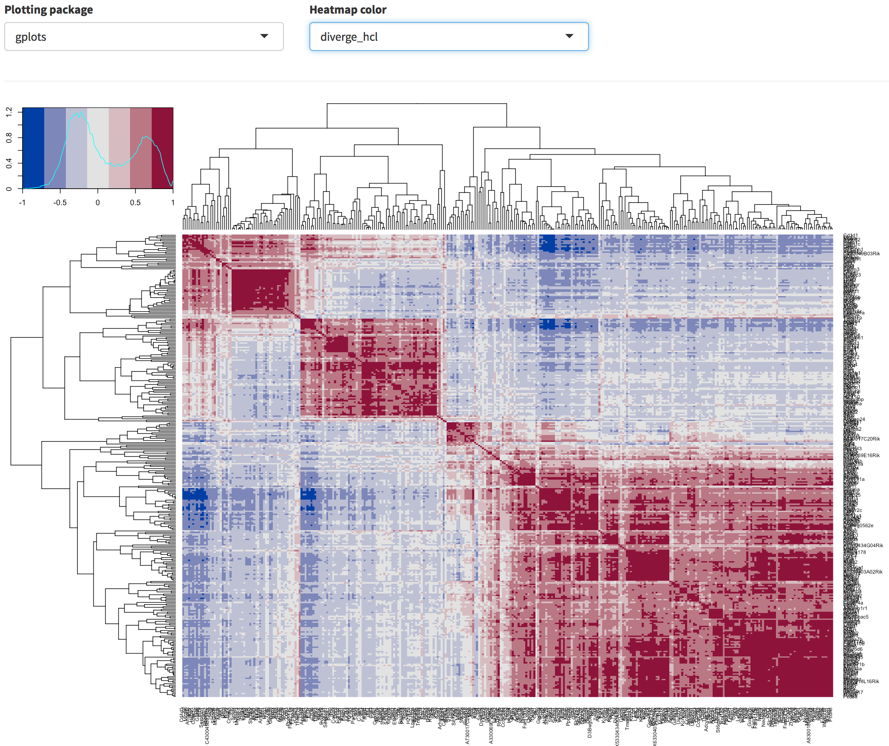

* Similar to sample correlation, feature correlation heatmap shows the block correlation structure of your features. You can adjust various parameters of this analysis, including distance measure (absolute correlation means neglecting signs of correlation coefficient), correlation method (pearson, spearman or kendall) and agglomeration method for the hierarchical clustering built on top of the heatmap.

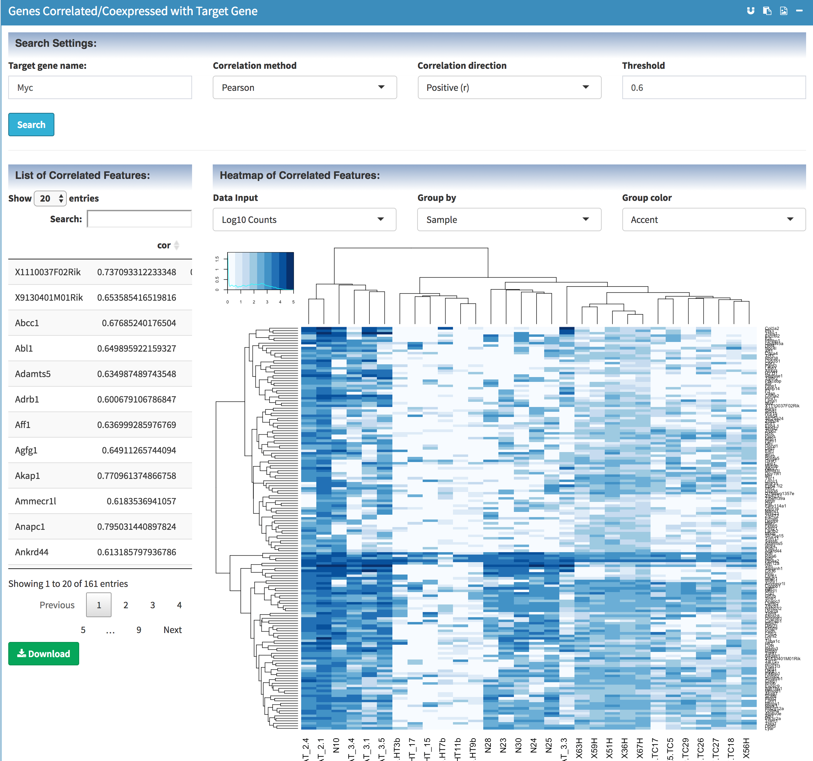

* Additionally, you can use this module to find genes correlated/co-expressed with a target gene of interest, as shown in the figure above. Simply type in the gene name, correlation method and direction, and the correlation coefficient threshold, and press "Search". PIVOT will list out genes above the threshold and plot them along with the search gene in an expression heatmap.

## Feature Heatmap

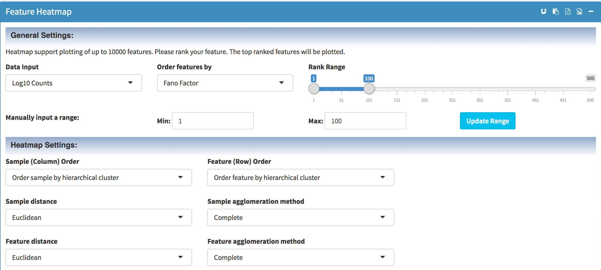

* You can set multiple parameters for the feature heatmap. By default, PIVOT will only plot the top 100 genes ranked by a chosen statistic (variance, fano-factor, row mean or median). You can change the number of genes to plot by using the range slider, or manually input a range. If you want to plot a specific set of genes, please use the feature filter in the File panel.


* Multiple aethetics can be adjusted in the visualization setting.

# Dimension Reduction

## PCA

* To run PCA, simply choose the type of input data and whether the data should be scaled, then press Run. You can specify the coloring of points and the palette for coloring after you have run PCA. You can download the tables for explained variance, feature loading and data projection. The Scree plot shows how much variance is explained by each PC.


* You can visualzie the 1D, 2D and 3D projection by PCA, and adjust relevant aesthetics. For example, you can choose which PC combination should be used for 2D PCA plot. Additionally, you can use ggplot or ggbiplot package (require installation from github) to visualize the 2D PCA plot. 

* You can directly drag on the plotly version of the 2D plot to specify groups for each sample (point). The grouping will be added as a meta column (pca_group), which can be used for coloring points and by other analysis such as DE.

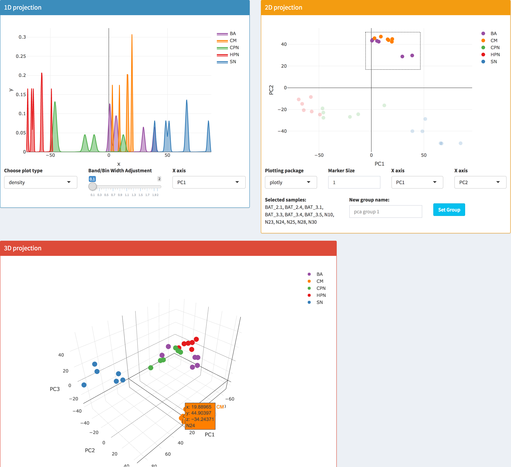
    
## T-SNE

* Note that unlike PCA, 1D, 2D and 3D T-SNE are results of 3 different t-SNE runs (parameter dims = 1, 2 or 3).

* According to http://lvdmaaten.github.io/tsne/, 
    
    *"Perplexity is a measure for information that is defined as 2 to the power of the Shannon entropy. The perplexity of a fair die with k sides is equal to k. In t-SNE, the perplexity may be viewed as a knob that sets the number of effective nearest neighbors. It is comparable with the number of nearest neighbors k that is employed in many manifold learners."*
    
* Similar to PCA, you can specify groups directly on the 2D plot.
    
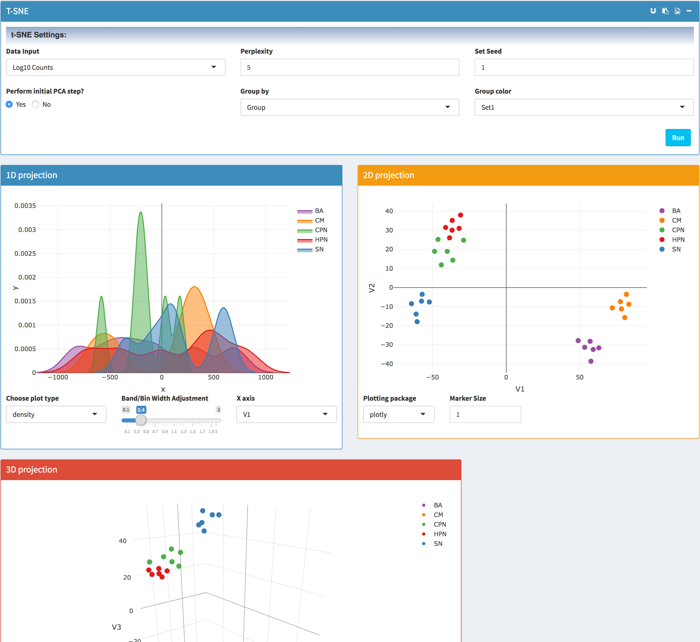
    
## Metric and Non-metric MDS

* See https://en.wikipedia.org/wiki/Multidimensional_scaling for details about this method.

## Diffusion Map

* The diffusion map module provides a graphical interface for the "destiny" package (http://bioconductor.org/packages/release/bioc/html/destiny.html). We suggest users to read relevant literature to understand the logic behind this method. 


    
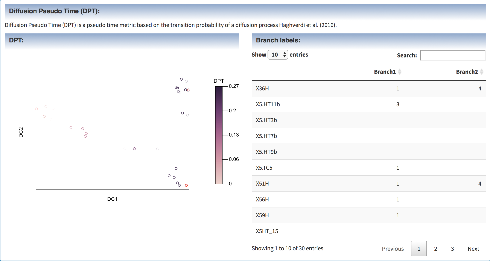

## PenalizedLDA

* This module provides a graphical interface for the "penalizedLDA" package, which implements the penalized classification using Fisher's linear discriminant algorithm. The plot below shows the feature weight on each of the discriminant vector. One can also visualize the 1D, 2D and 3D data projection.


# Gene Enrichment Analysis

* This module provides a graphical interface for limma's goana and kegga function, which performs GO enrichment analysis and KEGG pathway analysis, respectively.

* To start, select the analysis type (GO or KEGG), species of your data and whether you want to convert gene names to ID. Note the goana or kegga function can only take entrez ID as input, so you should either convert them outside of PIVOT, or inside PIVOT using the feature name/ID converter (Feature panel), or simply input gene name and check the "Convert gene name to ID" option. PIVOT will automatically find corresponding entrez IDs for your genes using the BioMart database.

* You can test custom gene set, or any of the previously computed DEGs. You need to specify the adjusted P value threshold as well as the direction of the log fold change. You can preview the gene set to be tested by clicking the green preview button.

* By default, PIVOT will show the top 100 enriched GO terms. Increase the number if you want to see more. This value will be sent to the topGO function of limma.


# Network Analysis

* This module facilitates the visualization of the gene network with different databases, and predicts potential lists of transdifferentiation factors based on a modified version of the Mogrify algorithm (https://www.nature.com/ng/journal/v48/n3/full/ng.3487.html).

* To start, choose your DEGs and species. PIVOT will automatically load previously computed DE results into this module. The gene score is computed based on the log fold change (LFC) and P-value to facilitate the ranking of the DEGs.


* Next, choose your network database. PIVOT currently includes the STRING protein-protein interaction database and the Regnetwork regulatory network database. For STRING, you need to specify a threshold for the combined scores of the interactions (score_threshold in STRINGdb$new function). By default, the top DEGs will be plotted in the network with the igraph package. You can change multiple aesthetics of the plot. Note STRING will produce an undirected graph while Regnetwork will produce a directed graph, showing the regulatory relationship.

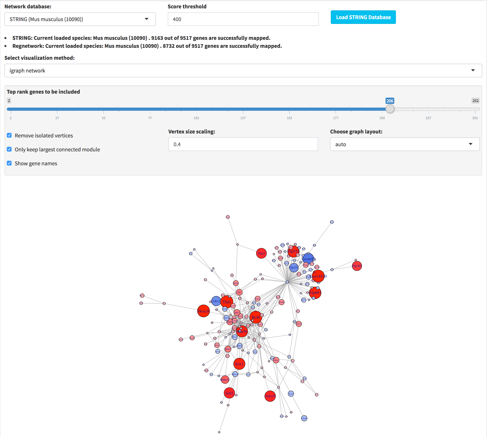

* For STRING database, we also provides interface for direct query to the main website (string-db.org). You can query up to 350 top genes and visualize their network relationship, as well as clicking the node and see detailed information about a particular gene.


* We adapted the Mogrify algorithm for predicting potential transdifferentiation factors with pairwise differential expression analysis results. Because there are no consensus on how to define a "Network influence score" for a transcription factor, we provide several ways for doing this, including the method described in the Mogrify paper. Thus, the resulting list should only be used as a "potential" guide list for further exploration. Nonetheless, we have found good agreement between the transdifferention list from literature and the predicted list using the FANTOM5 ES-fibroblast data.

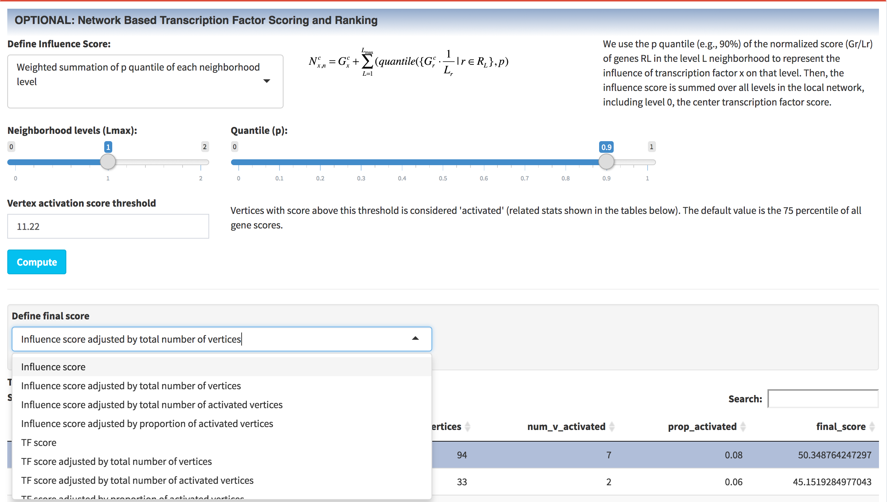

* Once the lists have been computed, one can click genes and see their neighborhood network.


# Classification

* This module is a graphical interface for the caret package (<a href="http://topepo.github.io/caret/index.html">http://topepo.github.io/caret/index.html</a>). Currently it allows the user to choose most classification models listed in (<a href="http://topepo.github.io/caret/modelList.html"> http://topepo.github.io/caret/modelList.html</a>). 

* Some methods may require new packages to be installed. In such cases, the background R session will ask you to install it. Choose yes if you want to proceed.


    
* Users are expected to have the knowledge of which model is most suitable for their data. The details of these models can be found in the caret website. Also, a user is expected to split the input data into training groups and testing groups by including relevant info in the design information for the samples (such as a design category with "train_A", "train_B" and "test").

# Toolkit

## Venn Diagram

* If you have three feature lists produced by e.g., different DE methods, and you want to know what's their union and intersection. You can upload each of them (feature list as first column) and see the Venn diagram.

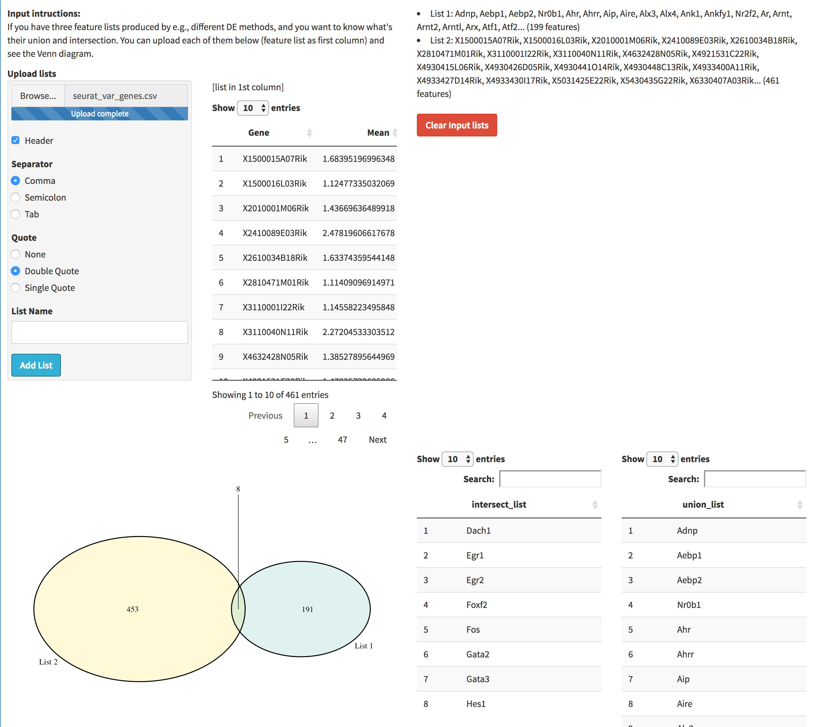

## Gene Annotation

* PIVOT provides interface for querying BioMart database. For example, if you want to find ensembl ID, chromosome location and description for a set of genes, simply click external_gene_name in the filter table, and choose "ensemble_gene_id", "description" and "chromosome_name" in the attributes table. Click "external_gene_name" to input the gene set, then press "Query Biomart".

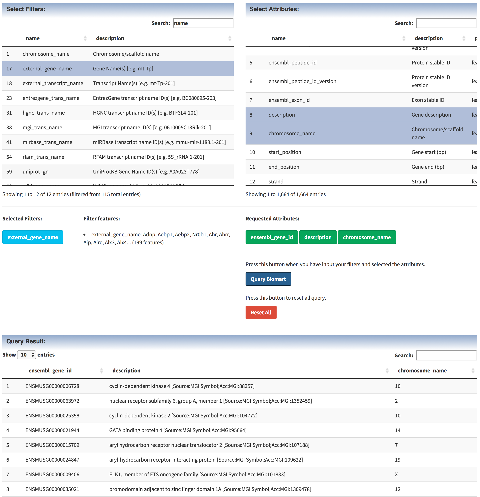


# Report Module

* The code has been pre-written for you -- you only need to add it. Simply click the "add to report" button once you've run the analysis, the code will be pasted to the report module.  


* The report code is based on R-markdown v2 (http://rmarkdown.rstudio.com/). You can add comments, change titles or modify the code (not recommended) according to the syntax.

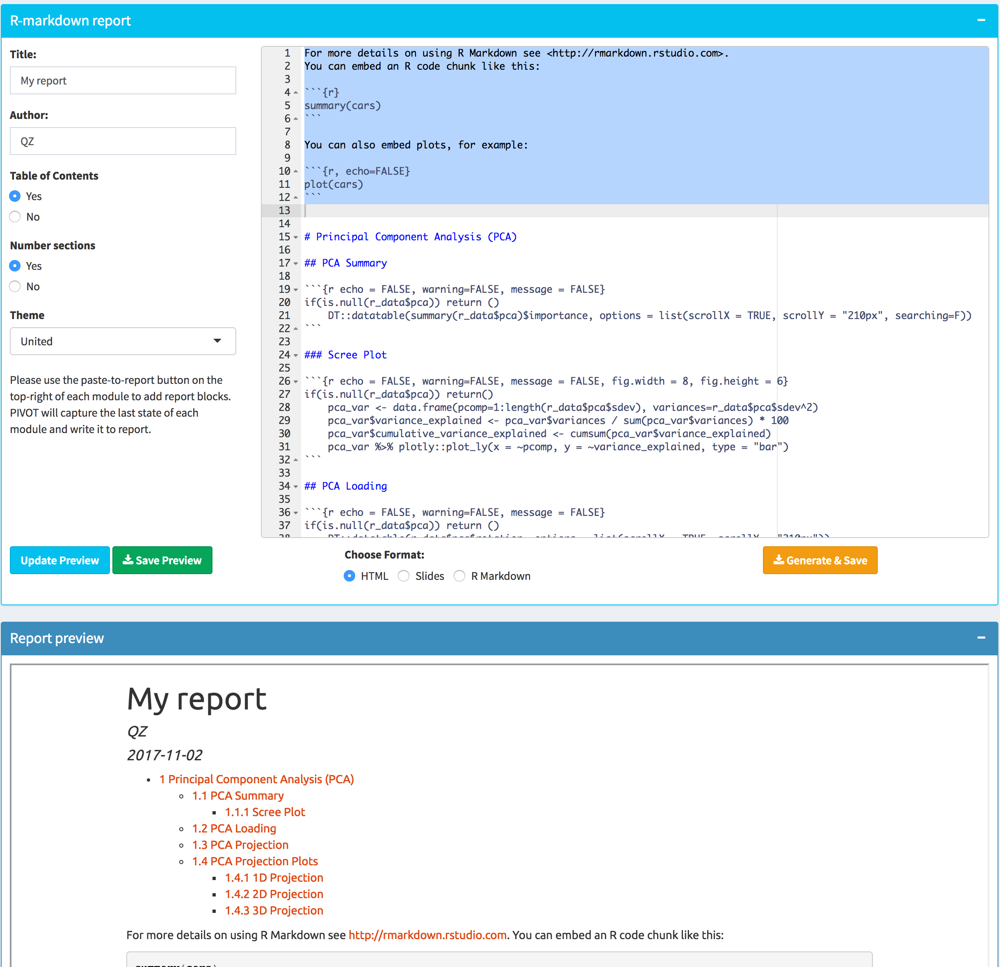

* You can also directly generate report or attach it to the current data node in the data map by clicking the buttons on the top right corner of the module.

# System Control

* The system control menu is located at the top right corner. Users can use this panel to save the program state, launch new session or go to launcher.


## Program State Saving and Loading

* You can save the program state as an R data object. In this way you can make sure that you won't lose your analysis progress, and you can share the state with others.

* To load the saved state, go to File panel and choose PIVOT state in input file type. The session will auto refresh and immediately switch to the loaded state when the state uploading is complete. 


* Each time you exit, PIVOT will automatically save the state into the background R session. If you don't close the R session, or save the workspace image before exiting R, the next time you launch PIVOT it will automatically load the state for you.

* To clear the state, click  or simply remove the R objects in the current R environment.

## Launch New Session

* Clicking the  button will launch new PIVOT session for you. In this way you can do different things in different sessions. There is a limitation for this: because one R session can only have one shiny instance running at a time, you can only perform one analysis at a time, no matter how many open PIVOT sessions you have. While R is busy computing for one session, the other sessions will have to wait in a queue.


    


